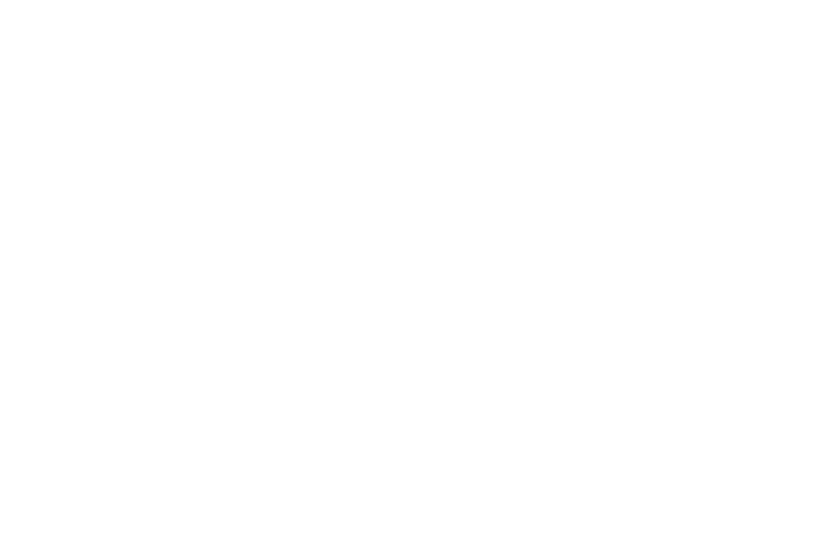
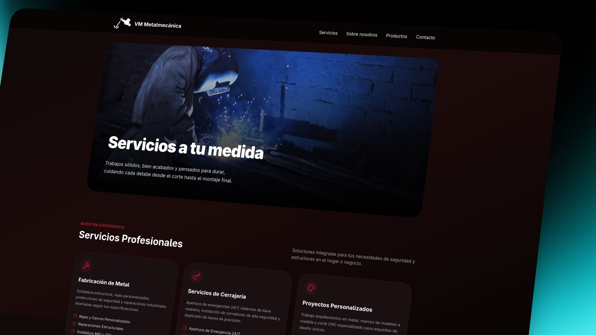
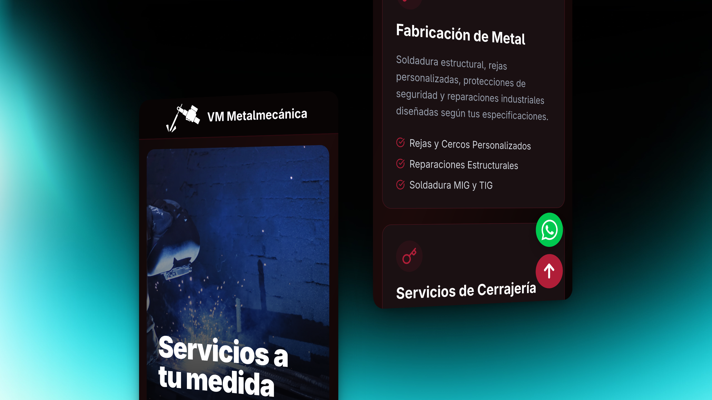

<table align="center" border="0" style="border:none;">
  <tr>
    <td align="center" valign="middle">
      
    </td>
    <td align="center" valign="middle">
      <span style="font-size: 24px; font-weight: bold; color: #b01e38;">VM METALMECÁNICA</span>
    </td>
    <td align="center" valign="middle">
      <span style="font-size: 50px; color: #555;">×</span>
    </td>
    <td align="center" valign="middle">
      <span style="font-size: 24px; font-weight: bold; color: #FF5D01;">ASTRO</span>
    </td>
    <td align="center" valign="middle">
      
    </td>
  </tr>
</table>

<div align="center" style="margin: 18px 0;">
  
  
</div>

<p align="center">
  <b>Forjados en Tradición, Construidos para Seguridad.</b>
</p>

<div align="center">
  
  <br>
  
</div>

## ✨ Características

-   ✅ **Diseño Web Moderno**: Interfaz limpia y profesional enfocada en la experiencia de usuario.
-   🚀 **Rendimiento Excepcional**: Construido sobre la arquitectura de "Islas" de Astro para una carga rápida.
-   📱 **Totalmente Responsive**: Adaptado perfectamente para móviles, tablets y escritorio.
-   🎨 **Componentes Modulares**: Arquitectura basada en componentes reutilizables y limpios.
-   🛠️ **Código Optimizado**: Uso de TypeScript y Tailwind CSS v4 para un desarrollo robusto y ágil.

<br>

## 📦 Estructura del proyecto

El proyecto sigue una organización clara y escalable:

```text
vm_metalmecanica/
├── public/          # Assets estáticos (imágenes, favicons)
└── src/
    ├── components/  # Bloques de construcción UI (Hero, About, etc.)
    ├── layouts/     # Estructuras base de página
    ├── pages/       # Rutas y vistas
    └── styles/      # Estilos CSS globales
```

<br>

## � Requisitos y Notas Importantes

> 🏗️ **Requisitos Previos**
>
> -   Asegúrate de tener **Node.js** instalado en tu sistema.
> -   Para problemas de estilos, verifica la configuración en `src/styles/` o `astro.config.mjs`.

<br>

## 🚀 Instalación rápida

```bash
# 1. Clona el repositorio
$ git clone <url-del-repo>
$ cd vm_metalmecanica

# 2. Instala dependencias
$ npm install

# 3. Inicia el servidor de desarrollo
$ npm run dev
```

<span style="font-size:1.1em; color:#FF5D01;">Accede a <b>http://localhost:4321</b> para ver el sitio en acción 🚀</span>
